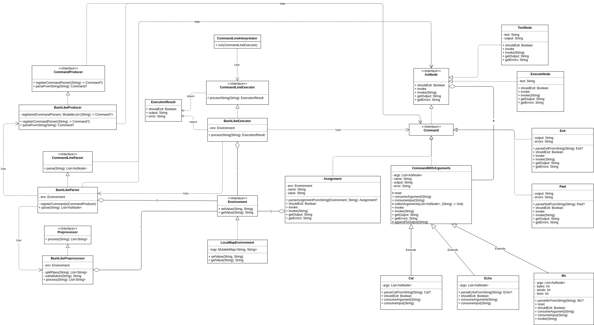

# Описание

Интерпретатор командной строки, поддерживающий похожий на bash язык. 

## Язык

Функции, поддерживаемые самим интерпретатором:

* **cat [FILE]** &ndash; вывести содержимое файла

* **echo** &ndash; вывести на экран свои аргументы по одному на строке

* **wc [FILE]** &ndash; подсчитать число строк, слов и байт в файле

* **pwd** &ndash; распечатать текущую директорию

* **exit** &ndash; прекращение работы интерпретатора

* **varname=value** &ndash; сохранение значения переменной, в дальнейшем используется подставновкой **$varname**

* **command1 | command2** &ndash; пайплайны, перенаправляющие вывод одной команды на вход другой

* Одинарные и двойные кавычки

Остальные вызовы переадресовываются bash'у.

## Сущности

**CommandLineInterpretator** &ndash; обертка над **CommandLineExecutor**, реализующая взаимодействие с консольным интерфейсом.

**CommandLineExecutor** &ndash; интерфейс, принимает команды в виде строк, исполняет их и возвращает **ExecutionResult**

**ExecutionResult** &ndash; хранит результат исполнения, а именно вывод в выходной поток и поток ошибок и то, пытается ли исполнение завершиться

**BashLikeExecutor** &ndash; реализация **CommandLineExecutor** для описанного выше языка. Разбирает полученную строчку с помощью 
**BashLikeParser**, получает корень AST соответствующий коду и исполняет его

**Environment** &ndash; интерфейс хранилища переменных со значениями

**LocalMapEnvironment** &ndash; реализация **Environment** на основе Map

**CommandLineParser** &ndash; интерфейс парсера, разбирает строчки в синтаксические деревья, им соответствующие

**BashLikeParser** &ndash; реализация **CommandLineParser**, поддерживает кавычки, подстановки и пайпы. Сперва строка
разбирается на токены (неделимые строки) с учетом особенностей кавычек, затем токены дробятся по пайпам на списки,
организующиеся в будущие команды с аргументами. После при помощи **BashLikeProducer** из них строятся команды и соединяются
в дерево.

**CommandProducer** &ndash; интерфейс сущности, умеющей сохранять парсеры команд из токенов и затем
применять их в том же порядке, в котором они были сохранены.

**BashLikeProducer** &ndash; реализация **CommandProducer**

**AstNode** &ndash; вершина синтаксического дерева для описанного языка

## Вершины AST

**Assignment**, **Cat**, **Echo**, **Exit**, **Pwd**, **Wc** &ndash; вершины, соответствующие командам, наследуются от 
**Command**, абстрактного класса, реализующего общую для команд логику.

**TextNode** &ndash; вершина для хранения текста. Используется для аргументов команд.

**ExecuteNode** &ndash; вершина, оборачивающая команду, которая перенаправляется в bash.

## Архитектура
Старая архитектура:

 

Новая архитектура ([ссылка](https://www.draw.io/?lightbox=1&highlight=0000ff&edit=_blank&layers=1&nav=1&title=cli.html#R7V3bcqM4Gn6aVGW2yi6EOF520slOVyW7XdM9OzuXxFZiqjF4AecwF%2FPsK4GE0QGMCcI47VSqOwghdPj%2B8y9xAa%2FXr%2F9Mg83qPlmi6MI0lq8X8POFiX8MH%2F9HSt7KEuB5ZlnylIZLWrYr%2BBb%2BhWihQUu34RJlXMU8SaI83PCFiySO0SLnyoI0TV74ao9JxL91EzwhqeDbIojk0j%2FCZb4qSz3b2JX%2FisKnFXszMOiddcAq04JsFSyTl1oRvLmA12mS5OVf69drFJHZY%2FNSPnfbcLfqWIrivMsDruk8uhb%2BhYHxaBnGzC1beA6iLR3sdbJeB%2FHyLozRlzhH6SZFeZAnKR1A%2FsZmJXsJ11EQ46urxyTOv9E7AF8HUfgU478XiLSAC55Rmod4Qj%2FRG3mywaWLVRgt74K3ZEs6n%2BXB4ge7ulolafgXbjaIaJv4dppTbJgOV%2BMbeRIXG7g0RRmu85XNCBCK7oNXruJdkOW0YJFEUbDJwodqGOsgfQrjqyTPkzWtxAZ9G0bRdRLhaSFzAR%2BLH3yfTiceLnptXCNQrTymGZSsUZ6%2B4SrsAUjBQsllZlH6edlhD3i0zqqGO5tSVUDh%2FlQ1vUME%2FoOCoiNAGA3WEHJh4mEa6Ta%2BrGHl5hUtthgmv0g4wTORF%2BuXJj8Qm7M4KYFTm0ZaxLAToce8ETnZJliE8dNdUeeztSv5jU4HKUrws49RQW6rcLlEMVn1BIM5KJeYrOcmCeO8mC%2F7Cv%2FiwV4bc%2FvCxh2%2Fxtdgd41%2FSfU0v05iPJYgLFYTYfy8IIKhbkuvJkAZC3TtMdA7LT2rN%2BzSm4qldyIy1g23xM7%2FtoSBUXq5gJ%2FwXWPziv8tpsUoy2fF0pF7Vu0eQceMrjm5R1lG1Sb%2B64n%2BX7w5rBUEa4KFSL4qGNdjsEBVMf8I1yKel1B8y0MqlbACivmvabLcLoqeslYexGdw2WZ%2Fy6uUTCYTemzcoHkKek1%2BSU7V7MttFzSNnsIMTx0bY5BmKL28vMOF%2FAR%2Fy1NMbOJ8YogZct1PWf4vrBMIleEt5hTGTGzCoK8u78tTdlXSU4Zu02T9HTOUONPWvWK2dv1Rr6rA7NTsSuBpNcZEGCAToCUEMNWV17fBOowIH%2FgVRc%2BItErAkq%2BZQBxA1Mxcg5c1riHxGwso%2BE2l4QzLcOCZ4TQynLqQ%2FVBMZ5MmC5RlJc1elv9R4ivHGybxbyjbRnnLZEklH4hKgUCkwJQVQtNSUKkPdBCpdSbSViItpeahJKqHvrpRx%2FRYAplCnhV0Fdwfj%2FxntsPTv2UA2SrwFfTvaRHS9pn%2BZfq%2FiZ%2FDNInXZE0PpPyJ0N3YrInUzVD%2BHwKjS6awExWdkX2D9v%2FEP0PZQ6XxfzTqB5Y5tznyt10F%2Bdv2WOTvnMlfJv%2BdLPo4enm2SrbR8uY1pFWvkiRCQdxEl2H8jM3xY6k42aboGc8n%2Fr3NN9u8gUHwTxyiKOmbctznmzRN0mw%2FU9PdlTD7lD5tC3mmWv0PxGE93%2BP4K2ObdfYKFewVWFr4qzdB%2Fioxs4o3MvdYC9s8KT1oRtYzfcoGMDr0djIO1uiYXGJWSYhfg2fEeEXWgVno7VPBt47ei6RN8ozWC3SQLJkE%2FanlObwgsQlsLUxYfkuaKHl4kcQZJgxGHpeUffxy0c4vj6Y6zYo%2BRxFa5BVJK%2BIrDVyQWG%2B1ISqiO7%2FHYf7LhBfxrMh%2BKEW2iZcEmw2Kl9%2BTcl4vBY9Dw5wev9sZQ8JJ9LibFdG133VEn7a5wdLhKm%2BuLdkbEPiKHA%2Fm4xnU3oBTjLlW9sJVkK3uwh89YyqT0GgKRSx%2BpgFNpZt4uh0XEkKySyH7pT1Hg3fRMqVhl0lxPCn1N2lzE4V5mUJy9fY13KCumSSNEamuiSjHtB2rkX%2BJ84Qm0OwJtDUMYvxubx%2ByPMyLhIDu3v%2BybBk%2Bd9KRuHonLWdmDks6ZnEDKKcNQMNUOLZsHXkDcIpxQ0nQ9M2wmQzHPklRM1wi0Jj8SNXf0gjm8ifbh3BmVkWmEs%2BqVD54aKpCnJ4OTjXFEGfFhe4SvKr3webUMw5mRU06M%2FfbIikfD0uteuzyArqrIZMYZb88hyO5bA7Mq%2FhZmRUw%2BIQM1zIlbmWyTTxcPqaOgCGUt3BNiFt9xw%2F2yYyYBPHO6MiPHceZRjTpsMjaJBaQta3TMTluv%2Fck5UwwHNC4AmKYZZoT3if6Molet8Zfuvb6JxTuJlP%2F2fZbz5XzgVR7MIHt6hDv%2FpTFe2nUotOW8IUTNO%2Fj%2FTweX52OWvBhkkz6qwVTFK%2F9FIXj9%2FusFpzVgkmqBT6vFviyzd%2BgFehwUbLU42lqBVXUvucZCZMQEvXwN1pyHv2SfKhCED9km%2BMQufB%2BY%2BQi6rOVNaYjnRehVtEmi69TOXHjGL7o6oQPVSxw34kcP6uImjlMKrAoGmujfpoH2zvMn%2Bbh65BRYMoy6lOW4YdOOnp2aKh%2F7K0oO3qb7WBwUmYiFXvFG6o8%2FYI57eCzO4ioNqCq8iW3Nmp23ZJjVkPpFNLmupqWP0G2PqnbYXfHWS6ZkJ32We1flx2qluGpTCeoQyyZUxZL18HpyiNcsd%2B%2ByZM7n0YtE%2FDa7REGek%2BqC85C4syo38GoHY%2B3HzxlFp6rYNRQR8KwNemdKTeLVXLm1BMeZxunJou3h1WzwrpLXCv7LgDF%2BTSOG0OYPBOX90CeebgJDKcDE2cn14%2FAxKd4WuSOiRNknyITb2VueFDd9FD%2BYZ5bqZ5rcVSUPOKsfZ61z%2F6fPWDmPuVcUHHOnWkp%2FARa0qqtSW9X%2B%2Fqy%2FHB8C49pEPOZciQyRWeGdPaZfgxmaCtO5odAwQz1nMxvTXpL3B%2BLk2SGI1jiurr98JYj2u8vxwk6viTp8rg9iMK44xxMAm1tovePxTEd15h8pyOoxWPmflYdoY%2Bc1kVptC9fYvXRV2P34zaMEMl5OHuglKqLLXy%2FzlV5oJQfMdOiutiq%2FbHCDKN4%2BYl8JxJfPUQJ%2BZbg1TLIVmhJpwXfvy0mtfhmHL6qz2tt%2BhCm3f%2BSWnOruEWu%2F8TXM2NumJAWfEVpiIdFvov42ajmHC2lb1AKM457nGzTBWoYZ3m%2Birws9QRl5htMURTk4TP%2FQtWs0%2Ba%2Bkq%2Fk7Za4%2BpwlSzRzhYUrO0qf2q2doiGLb4itDWsox7SJcqmhAgTVGHviwhsRFzHuZwkMm13%2BKWHGriFmSGBQS6Kcy4ZK5Vd9RkHPDDh8Kr3twbndD0ByW1BqSyeGVJvzjoChgZDC7Ml2pDijIcX3LeHbF9XXZw4Fii%2FgBEJ%2FNJQ4qkTY00UJ2x%2FbjpLxpNHMtPi19cSNuJ25idSS4Y6HEvMYekpfmTPOylqQJ3%2Bpjc4ra0Fe0wCiyqJzZeVElt8z1La4yab4WLGwgNxSd6B5g9dIfau21gwFmpRR9s3Qdh4BR0NSFfFmQOqpsFrCFouq3T0wwgsbvNWq0c9ODw20iQfbu5%2FhdzpO3Am6bo5%2FLkDZj%2BJkgP3dOGlvxwyIIsqQvR1A9XFWT8dp3o4ctQYqQmsWPcswWCfx8vsqjFsUCtNqFEEWp3bODcjEjlrhKKrqkkJ2Byk0ot8ECn4TKH6hr7MY8vY0pFObkUOBKcq3aSyhqoYPkagfkjxP1iWkBKVHVGgp4rw6ykAdY8bctesQqwOsgNtAaIJd0OQ0%2BFHeiRxBfbH6AkfUg6APOrpLmjWYTj2G1NPX1DFRP3O46viP8v2DodiVbfJjo%2FgwqB4DhdKHyN2%2BbjtozIHrWK5hex4GJRCsM2i6c3rL9C0Aulnhh0LUUo%2BmkekKEKX7E%2FRBVHYIDGs2UoYJJIa5k%2BY8Qs2xuWnpkBwnpiGIVEsMRvU1EaWGBkKvaxzGYcX6FvWA6MOvbrdHpVOasI5hrHMC0MJnQVMgTqcq2gnucDyHyEwI0lq21TcGA%2FY3NRDkgSN8CVu7liA7VMY1pzCWDZeHr2P4jdqua2uGcTeLajwYm6Y%2F32kJjsXO6qwii616RPcwdetboGvO6Z1CoRF2rWu0xVw5t0EPi%2BVQNqgaMCLLswUjw3b7RhOkk3Z8SwvDk7%2FhQ7vc3DPvnQ%2BwoejjqXLexT%2FqPFXhjCS%2BvFnp6CXORJM4JAtno%2BR21MeIZVut5nE0D2OxU4mvA2B6PFpAT4oAwLbnsMYj%2BTiq68%2F9HX9kltPg6oFp2EK%2BABtQY7%2FlR4CtWy%2BWk0ZuXnOMwawNvyzeW%2BPcjgTkGnLr%2FnDBQ2u%2BIzNgKuaa5%2FFf0fTYITOHItcBEgAMcUOZRgnOuO%2FRwNCSj0ZCFHW5bxjMla9Ju7Q6ZaqNCDLfm5s7LxU0ecj5ePZquqXTD4DtL3HaX6ITmbKHdFxkum3Q1JQraXXKbRoPgb7RBg7fGASB7S9x21%2BiE4GmhMAu0HtfRlSzM1RQAQe1gtwusBtRMTQEU6m36Sy15Dhzv%2Fbj6nHtA2CJYp3lJDWrsNIjAHARgeFVQU91xNGoCB8Uxf54ADWFY06kvSPdAQpNcdnhiPqf7MEZx8OoDP64A6JhxAzgvV5AwEcb%2ByEFCp4SRzwwRydMZJvxCCmkHuDhYmjOIu22c2U8sTgTIWBbPbHkAL6hmbRtfygPInSFDTJmuxicAYGzHvxANZbmvRiSZNbscvGbjyKX00%2B7sd3D6KurAW40suYhObM1MbJyhM8%2Fyx6Yzp55cfNpZ2fOwYQlwt6y9njaT4FOZItrUDEjkUElWlxNBj0wx4OxBQ3Z5ugJZE8gCQvokg9szasuu%2B2odD0Rxgc%2BwFT3rkMX6mtA%2FWFW2DCQJ5F9yHF4x9GsTpVBy3FowRTx25ejj0YIpqCSmX57OqD0wMenHGi50F%2Ba7sLzkQ8f3JksLu6DUE6hzV7CdRTEiJEDvUPgzvZ10F1Eco5tuf1jsQqj5V3wlpB9LZ%2BzPFj8YFdXqyQN%2F8LNBozk8O20isw6XI1v5ElKVSkiIeWvjIiAUHQfvHIV7wLyjdCiYJFEUbDJwodqGOW2mCuaD1xUYoMm5vh1EpGdMHgu4GPxczHI5hNbSOmbWYpP1ao%2BRG%2BbzQTdde%2BJBAYVFy23DIXxJSVHhz87iJ7XJ%2BKl%2FOY6Xsc0%2BYHY3MVJCaDadNIiYW%2BQGkHZJljgl94VdT5bu5Lf6LSQotq2olW4XBZ8Pk3yoPjQGV1XykhwR%2B0r%2FItn95qIffszOf3IJtvP2DX%2BJdXT%2FDqJ8ViCsFhVhHH0grK8KwTURCdjoqL5bhAwHQ0QkNPl9HgpRFc8rEtWctgK5I0nYDdFLgdMlmsiiHYzazyZbAnyqvfmI5YkUrleu4WEtOyBlSZd3gCnCYJMf1O7yoBfP%2F8HTBiBY54bxA7dYMgR8oA652OKOzesbod5jINAeX%2BcprR3i8vPADXMKTGmiqqPjbXxnEqmxWMN9sQaFBxKtiZHrbil09qj64uuaGtoK9k34WJhPz44%2FoNnI1Oh64%2BbDmL4%2FM7iJtZZD1dAjj4MoNvAnliSnBhl8Pp6o1zHFzxbrsi7h9rVxJzTQpcbTV5BpHhDu0hFMpCtnDHJgGgdPq%2F8ep7zfi1iKogFVXS2CrL2jeuL25Lsjke1DAES2Q4aGyS8ajp3fK%2FOGuWgv85NQ%2BwbMNMBmSOAjJ0F2QNkntDSe22hhhdJ%2FlTK95oT24UHbO9d25XxZZqQzRa76mmwWd0nS0Rq%2FB8%3D)):

 

* Убрано деление на команды с аргументами и без
* Логика препроцессора перенесена в парсер
* От построения нескольких деревьев и последующей их обработки **BashLikeExecutor** перешли к построению одного AST на этапе парсера
